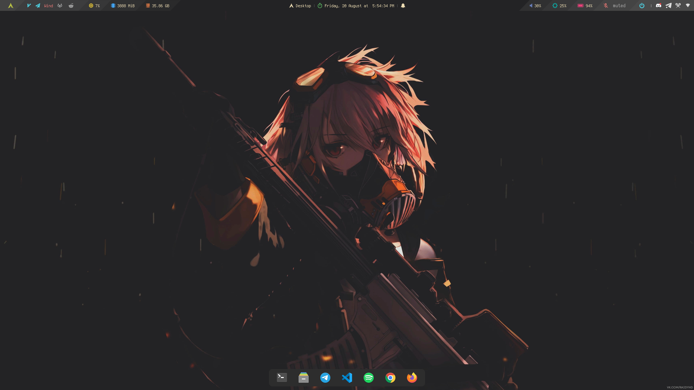
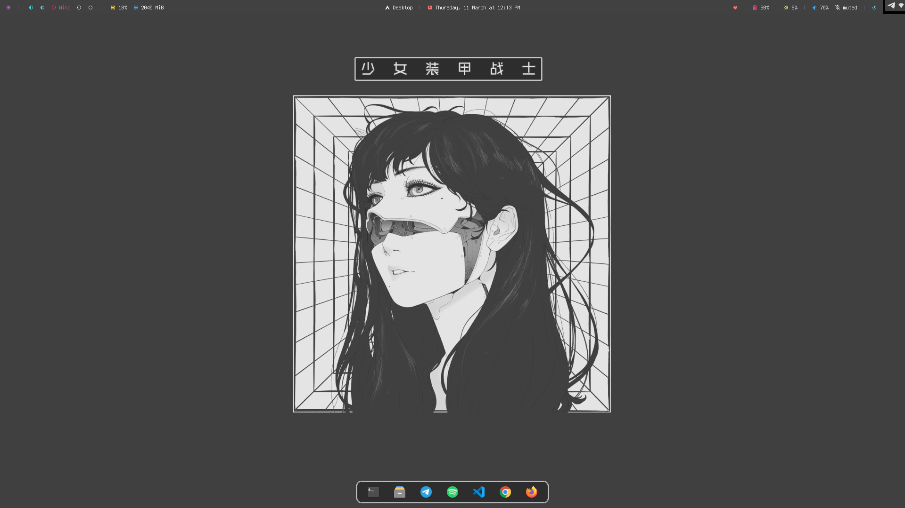
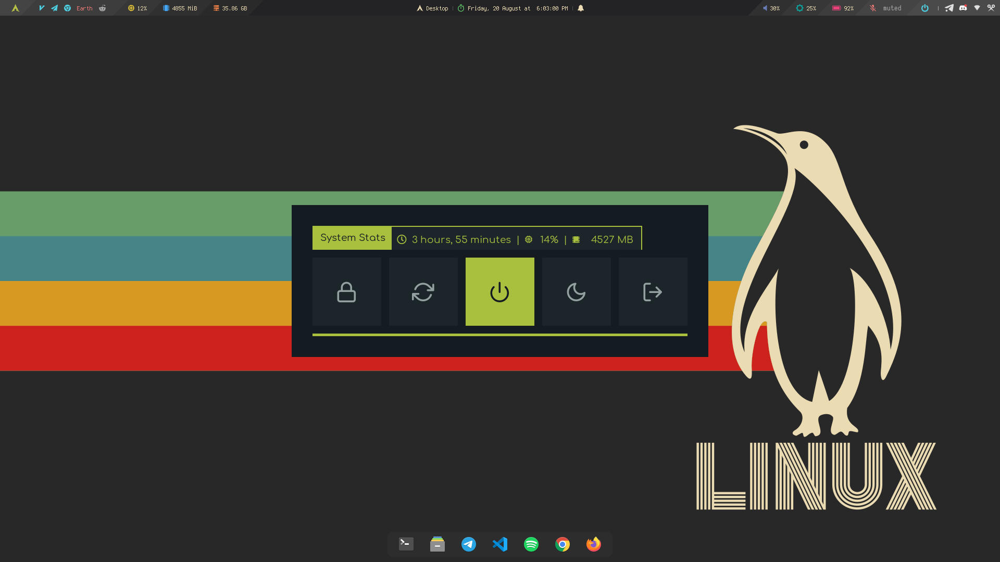

---

## Getting started

```
git clone https://github.com/knight-byte/Dotfiles.git
cd Dotfiles
```

## First Look




---

## Configuration


| Os                         | Arch Linux            |
|----------------------------|-----------------------|
| Wm                         | Bspwm                 |
| Top Bar/ Application panel | Polybar               |
| Dock                       | Tint2                 |
| Notification               | Dunst                 |
| Application Launcher       | Rofi                  |
| Poweroff Menu              | Rofi                  |
| Preview 1 Wallpaper        | Gruvbox Waifu         |
| Preview 2 Wallpaper        | Cybrorg               |
| Preview 3 Wallpaper        | Linux Logo            |
| Preview 1 & 3 Dock config  | panellauncher         |
| Preview 2 Dock config      | panellaunchercyborg   |

---

## Keybinds

These are the basic keybinds. Read the `sxhkd/sxhkdrc` file for more keybinds.

| Keybind               | Function                                  |
| --------------------- | ----------------------------------------- |
| `Win + Shift + Enter` | Launch terminal (Konsole)                 |
| `Win + Shift + C`     | Close window                              |
| `Win + O`             | Open rofi menu                            |
| `Win + Shift + Q`     | Open rofi powermenu                       |
| `Win + F `            | Open Firefox                              |
| `Win + V `            | Open Visual Studio Code                   |
| `Win + B`             | Toggle dock                               |
| `Win + Z`             | Activate inhibitor (Stops autosleep)      |
| `Win + Shift + Z`     | Dectivate inhibitor (Enables autosleep)   |
| `Win + Space`         | Cycle through layouts                     |
| `Win + T`             | Make a floating window tiled              |
| `Win + <1-5>`         | Switch through different Workspace        |
| `Win + Shift + <1-5>` | Shift Application to Specific Workspace   |
| `Win + Q`             | Reloads Bspwm Config                      |
| `Win + Esc`           | Reloads Sxhkd Config                      |

--- 
#### Special Thanks to

- [Aditya Shakya](https://github.com/adi1090x) for Polybar base config

---

Made with 💜 in India
